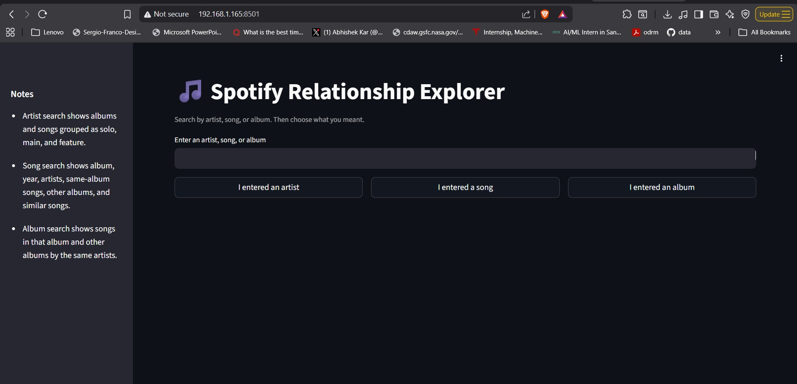
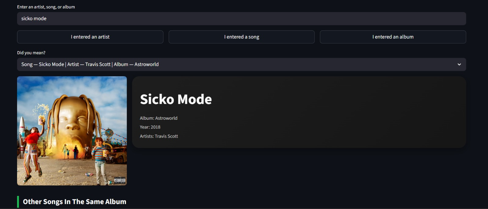
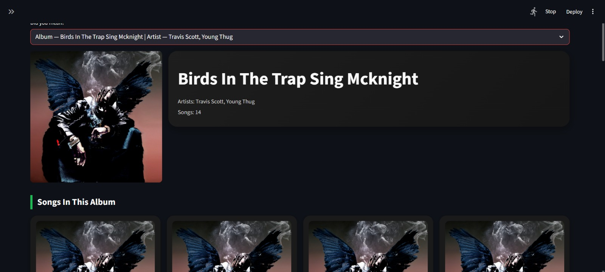
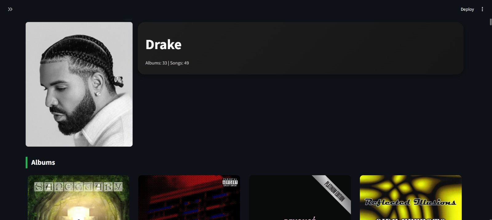

# Spotify Artist Hashing Project

## AI Usage

AI tools (ChatGPT, Claude) were used only for assistance in designing the **user interface (UI)** of the project.  
The hashing logic, algorithm implementation, and data preprocessing were developed by the members of the group.

---

## Project Overview

This project analyzes a Spotify music dataset and organizes songs using hashing.  
The main goal is to efficiently group songs by artist and allow quick retrieval of songs associated with a specific artist.

Hashing is implemented using Python dictionaries where the artist name acts as the key and the related song information is stored as the value.

The dataset used in this project contains metadata such as track names, artist names, album information, and Spotify artist IDs.

---

## Dataset

The dataset used in this project is too large to upload directly to GitHub.  
You can download it from Kaggle using the link below:

https://www.kaggle.com/datasets/rodolfofigueroa/spotify-12m-songs

After downloading the dataset:

1. Extract the files  
2. Place the dataset file inside the project folder before running the notebook  

Example folder structure after downloading the dataset:

```
project-folder/
│
├── Project.ipynb
├── README.md
├── hashing_report.pdf
└── dataset.csv   (downloaded from Kaggle)
```

Note: The dataset file is not included in this repository because it exceeds GitHub's file size limits.

---

## Dataset Description

The dataset used in this project is the **Spotify 1.2M+ Songs dataset** available on Kaggle. It contains audio features and metadata for over **1.2 million tracks** collected using the Spotify API. Each row represents a single track and each column represents a feature or metadata field related to that track.

Some of the key fields in the dataset include:

- **id** – Spotify track ID  
- **name** – Track title  
- **album** – Album name  
- **album_id** – Spotify album ID  
- **artists** – List of artist names associated with the track  
- **artist_ids** – List of Spotify artist IDs  
- **track_number** – Track position in the album  
- **disc_number** – Disc number in the album  
- **explicit** – Whether the track contains explicit content  
- **danceability** – A numeric score indicating how suitable a track is for dancing  

The dataset contains over **1.2 million songs**, making it useful for testing algorithms on large real-world music data. In this project, the artist and track metadata are used to build hash-based indexing structures that allow efficient retrieval of songs by artist.

---

## Project Structure

```
project-folder/
│
├── Project.ipynb                 # Main project notebook
├── spotify_streamlit_ui.py       # Streamlit user interface
├── hashing_report.pdf            # Explanation of hashing implementation
├── video.mp4                     # Project demonstration video
└── README.md                     # Project documentation
└── images/                       # UI screenshots used in README
    ├── ui_home.png
    ├── ui_song_search.png
    ├── ui_album_page.png
    └── ui_artist_page.png
```

---

## Requirements

Before running the project, make sure the following are installed:

- Python 3.x  
- pandas  
- numpy  
- scikit-learn  
- matplotlib  
- streamlit  

Install the required libraries using:

```
pip install pandas numpy scikit-learn matplotlib streamlit
```

---

## How to Run the Project

### Step 1: Clone the repository

```
git clone <repository-link>
```

### Step 2: Navigate to the project folder

```
cd project-folder
```

### Step 3: Install required libraries

```
pip install pandas numpy scikit-learn matplotlib streamlit
```

### Step 4: Download the dataset

Download the dataset from Kaggle and place the dataset file in the project folder.

### Step 5: Open the notebook

Run the following command:

```
jupyter notebook
```

Then open:

```
Project.ipynb
```

Run all cells sequentially to execute the project.

---

## User Interface (UI)

This project includes a **Streamlit-based user interface** that allows users to interact with the system and search for artists and songs.

### Running the UI

To launch the interface, run the following command in the terminal:

```
streamlit run spotify_streamlit_ui.py
```

After running the command, open the link shown in the terminal (usually):

```
http://localhost:8501
```

If the UI server is already running on the network, it may also be accessible at:

```
http://192.168.1.165:8501/
```

Note: The network address will only work for users connected to the same local network.

---

## User Interface Preview

Below are some screenshots of the Streamlit interface used to interact with the hashing-based search system.

### Main Search Interface



This is the main interface where users can enter an **artist, song, or album name**.  
The system then identifies the type of query and retrieves the relevant data using the hash table.

---

### Song Search Example



When a song is searched, the system displays:

- Song information  
- Album name  
- Release year  
- Artist(s)  
- Other songs from the same album

This allows users to explore relationships between songs and albums.

---

### Album View



The album page shows:

- Album artwork  
- Album title  
- Artists associated with the album  
- Number of songs in the album  
- All songs that belong to that album

---

### Artist View



The artist search shows:

- Artist profile  
- Total number of albums and songs  
- Albums created by the artist  
- Songs grouped by category (solo, main artist, or featured)

This information is retrieved efficiently using the hashing structure built during preprocessing.

---

## Video Demonstration

A short video demonstration of the project explains the hashing implementation and shows how the Streamlit interface retrieves songs by artist.

Video Link: [`video.mp4`](https://drive.google.com/file/d/13SfeH31eCq4tB6mdvwpI6G8PsCyJSwVo/view)

---

## How the Program Works

1. The dataset is loaded into the program.  
2. Artist names are cleaned and normalized to avoid duplicates caused by formatting differences.  
3. A hash table (Python dictionary) is created where the artist name is used as the key.  
4. Each artist key stores songs associated with that artist.  
5. Songs are categorized into:
   - Solo songs  
   - Main artist songs  
   - Featured songs  
6. This structure allows fast lookup of songs by artist without scanning the entire dataset.

---

## Authors (Group 4)

- Simran Kharbanda (UID: 122283671)  
- Shashank Ashoka (UID: 122241329)
